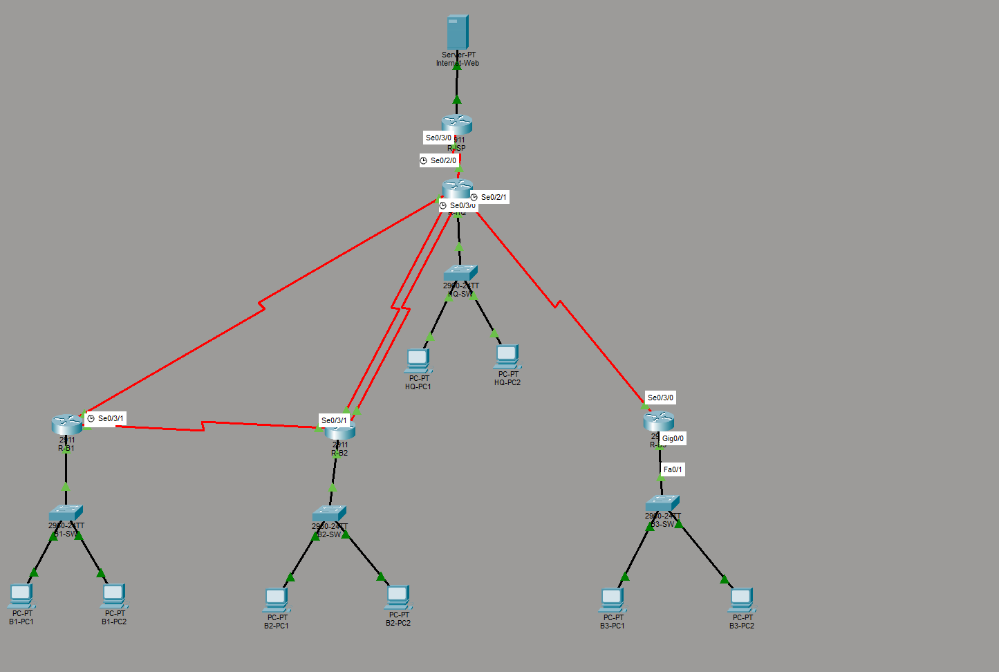

# Multi-Area OSPF WAN with NAT/PAT and Dual-Homed Redundancy

A Cisco Packet Tracer project building a five-router enterprise WAN: multi-area OSPF dynamic routing, MD5-authenticated WAN links, route summarization, NAT/PAT for internet access, and dual-homed branch redundancy that actually survives a link failure.

This is **Project 3** in my Packet Tracer series. It builds on the static-routing foundation of earlier projects by introducing dynamic routing, and goes beyond the reference design by fixing a redundancy flaw the original topology never accounted for.

📖 **Read the full write-up on Medium:** [Building a Multi-Area OSPF WAN with NAT](https://medium.com/@kwadwoosei724/building-a-multi-area-ospf-wan-with-nat-82f5674b7354)

---

## Table of Contents

- [Overview](#overview)
- [Topology](#topology)
- [Devices](#devices)
- [IP Addressing Plan](#ip-addressing-plan)
- [Interface Map](#interface-map)
- [Configuration Highlights](#configuration-highlights)
- [The Null0 Summarization Gotcha](#the-null0-summarization-gotcha)
- [The Redundancy Flaw and the Fix](#the-redundancy-flaw-and-the-fix)
- [Verification](#verification)
- [Known Issues & Gotchas](#known-issues--gotchas)
- [Files](#files)
- [Future Extensions](#future-extensions)

---

## Overview

A headquarters with three regional branches connected over serial WAN links, plus a simulated internet behind an ISP router.

**What's implemented:**

- Multi-area OSPF: backbone Area 0 plus three branch areas, with R-HQ as the Area Border Router (ABR)
- OSPF MD5 authentication on every WAN link
- Route summarization on the ABR (and the lesson learned from summarizing a /24 as a /24)
- NAT/PAT (overload) so private 10.x hosts reach the public web server
- Dual-homed redundancy for Branch 2 — a second HQ link in the same area, providing true route-level failover

---

## Topology



```
                  [Internet web server] 203.0.113.10
                            |
                       [R-ISP] 198.51.100.1   (external, not in OSPF)
                            |
                     NAT outside / inside
                            |
                       [R-HQ]  Area 0 backbone · ABR · NAT/PAT
                       /    |    \         \
                   Area1  Area2  Area3   (secondary Area 2 link)
                    /       |       \         \
                [R-B1]---[R-B2]    [R-B3]      |
                  |  redundant |               |
                  |  (Area 1)  +---------------+
                  |                  dual-home (Area 2)
              B1 LAN              B2 LAN            B3 LAN
            10.2.0.0/24        10.3.0.0/24       10.4.0.0/24
```

Each branch router connects to HQ on a dedicated serial link in its own area. The B1↔B2 redundant link is in Area 1. The hardening adds a second HQ↔B2 link in Area 2 for true failover.

---

## Devices

| Device | Model | Qty | Role |
|---|---|---|---|
| R-HQ | Cisco 2911 | 1 | Hub, ABR for all areas, NAT/PAT |
| R-B1 | Cisco 2911 | 1 | Branch 1, Area 1 |
| R-B2 | Cisco 2911 | 1 | Branch 2, Area 2 (dual-homed) |
| R-B3 | Cisco 2911 | 1 | Branch 3, Area 3 |
| R-ISP | Cisco 2911 | 1 | Internet edge (no OSPF, default route) |
| Switch 2960 | Cisco 2960 | 4 | One LAN switch per site |
| PC | PC-PT | 8 | Two per site |
| Internet-Web | Server-PT | 1 | Public web server behind R-ISP |

**Serial modules:**
- R-HQ: 3× HWIC-2T (4 branch/ISP links + 1 secondary B2 link + spare = needs 6 ports → 3 modules)
- R-B1, R-B3, R-ISP: 1× HWIC-2T each
- R-B2: 2× HWIC-2T (HQ primary + B1 redundant + HQ secondary = 3 ports)

---

## IP Addressing Plan

| Segment | Network | Purpose | OSPF Area |
|---|---|---|---|
| HQ LAN | 10.1.0.0/24 | HQ users | 0 |
| Branch 1 LAN | 10.2.0.0/24 | B1 users | 1 |
| Branch 2 LAN | 10.3.0.0/24 | B2 users | 2 |
| Branch 3 LAN | 10.4.0.0/24 | B3 users | 3 |
| HQ–B1 | 172.16.1.0/30 | WAN P2P | 1 |
| HQ–B2 (primary) | 172.16.1.4/30 | WAN P2P | 2 |
| HQ–B3 | 172.16.1.8/30 | WAN P2P | 3 |
| B1–B2 redundant | 172.16.1.12/30 | Failover (adjacency only) | 1 |
| HQ–B2 (secondary) | 172.16.1.16/30 | Dual-home failover | 2 |
| HQ–ISP | 198.51.100.0/30 | Internet uplink | External |
| NAT public pool | 198.51.100.8/29 | PAT pool | — |

---

## Interface Map

Interface names reflect the actual slots the HWIC-2T modules landed in — they are not the spec's defaults. Always confirm with `show ip interface brief`.

| Device | Interface | Connects To | IP |
|---|---|---|---|
| R-HQ | Gi0/0 | HQ LAN | 10.1.0.1/24 (nat inside) |
| R-HQ | Se0/2/0 | R-ISP | 198.51.100.2/30 (nat outside) |
| R-HQ | Se0/2/1 | R-B3 | 172.16.1.9/30 (nat inside) |
| R-HQ | Se0/3/0 | R-B1 | 172.16.1.1/30 (nat inside) |
| R-HQ | Se0/3/1 | R-B2 primary | 172.16.1.5/30 (nat inside) |
| R-HQ | Se0/1/0 | R-B2 secondary | 172.16.1.17/30 (nat inside) |
| R-B1 | Gi0/0 / Se0/3/0 / Se0/3/1 | B1 LAN / R-HQ / R-B2 redundant | 10.2.0.1 / 172.16.1.2 / 172.16.1.13 |
| R-B2 | Gi0/0 / Se0/3/0 / Se0/3/1 / Se0/2/0 | B2 LAN / R-HQ primary / R-B1 redundant / R-HQ secondary | 10.3.0.1 / 172.16.1.6 / 172.16.1.14 / 172.16.1.18 |
| R-B3 | Gi0/0 / Se0/3/0 | B3 LAN / R-HQ | 10.4.0.1 / 172.16.1.10 |
| R-ISP | Gi0/0 / Se0/3/0 | Web server / R-HQ | 203.0.113.1 / 198.51.100.1 |

---

## Configuration Highlights

### Multi-area OSPF on the ABR (R-HQ)

```
router ospf 1
 router-id 1.1.1.1
 network 10.1.0.0 0.0.0.255 area 0
 network 172.16.1.0 0.0.0.3 area 1
 network 172.16.1.4 0.0.0.3 area 2
 network 172.16.1.8 0.0.0.3 area 3
 network 172.16.1.16 0.0.0.3 area 2
 passive-interface gi0/0
```

The ISP-facing interface (Se0/2/0) is deliberately NOT in OSPF — it's handled by NAT and a default route.

### MD5 authentication (every WAN link, both ends)

```
interface serial0/3/0
 ip ospf message-digest-key 1 md5 0spfK3y!
 ip ospf authentication message-digest

router ospf 1
 area 1 authentication message-digest
 area 2 authentication message-digest
 area 3 authentication message-digest
```

### NAT/PAT on R-HQ

```
ip access-list standard NAT-ACL
 permit 10.0.0.0 0.255.255.255

ip nat pool PUB-POOL 198.51.100.8 198.51.100.14 netmask 255.255.255.248
ip nat inside source list NAT-ACL pool PUB-POOL overload

interface gi0/0
 ip nat inside
! (all branch-facing serials also ip nat inside)
interface serial0/2/0
 ip nat outside

ip route 0.0.0.0 0.0.0.0 198.51.100.1
router ospf 1
 default-information originate
```

`default-information originate` injects the default route into OSPF so branches learn the way to the internet (`O*E2 0.0.0.0/0`).

### R-ISP (no OSPF — just a default route back)

```
interface gi0/0
 ip address 203.0.113.1 255.255.255.0
interface serial0/3/0
 ip address 198.51.100.1 255.255.255.252
ip route 0.0.0.0 0.0.0.0 198.51.100.2
```

---

## The Null0 Summarization Gotcha

The reference design included route summarization on the ABR:

```
router ospf 1
 area 1 range 10.2.0.0 255.255.255.0
```

This **black-holed all traffic to 10.2.0.0**. When an ABR summarizes an area's routes, Cisco automatically installs a summary discard route to Null0 to prevent loops. But summarizing a single /24 *as* that same /24 makes the discard route identical to the real network — and the discard route wins:

```
Routing entry for 10.2.0.0/24
* 172.16.1.0, from 1.1.1.1, via Null0     ← black hole
```

**Fix:** remove the summarization. With one /24 per area it provides no benefit. Summarization is for collapsing *multiple* subnets into a *larger* block, where the discard route only covers unused gaps.

```
router ospf 1
 no area 1 range 10.2.0.0 255.255.255.0
 no area 2 range 10.3.0.0 255.255.255.0
 no area 3 range 10.4.0.0 255.255.255.0
```

---

## The Redundancy Flaw and the Fix

### The flaw

The reference topology places a redundant link between B1 and B2 **in Area 1**. Testing failover (shut the HQ↔B2 link, expect traffic to reroute over the redundant link) revealed that B2's LAN became completely unreachable — `% Subnet not in table`.

**Why:** B2's LAN is in Area 2. It reached the network through R-HQ (the ABR for Area 2). The redundant link is in Area 1. When the HQ↔B2 link drops, R-HQ loses its only Area 2 connection, orphaning Area 2 from the backbone. The redundant link keeps B1 and B2 *adjacent*, but OSPF requires every area to connect to Area 0 through an ABR — and that path is now severed. The result is adjacency-level redundancy, not route-level redundancy.

### The fix — dual-homing B2 to HQ

The industry-standard solution: give the branch a second path to the core *within its own area* (not a virtual link, which Cisco treats as a temporary band-aid).

A second serial link between R-B2 and R-HQ, both interfaces in Area 2, on 172.16.1.16/30:

```
! R-HQ
interface serial0/1/0
 ip address 172.16.1.17 255.255.255.252
 clock rate 64000
 ip ospf message-digest-key 1 md5 0spfK3y!
 ip ospf authentication message-digest
router ospf 1
 network 172.16.1.16 0.0.0.3 area 2

! R-B2
interface serial0/2/0
 ip address 172.16.1.18 255.255.255.252
 ip ospf message-digest-key 1 md5 0spfK3y!
 ip ospf authentication message-digest
router ospf 1
 network 172.16.1.16 0.0.0.3 area 2
```

Now B2 has two independent backbone paths, both in Area 2. After re-testing — shut the original HQ↔B2 link — B2's LAN route **survived** and traffic rerouted over the secondary link. Because the backup is in the same area as the protected LAN, inter-area routing never breaks.

---

## Verification

| # | Test | Command | Expected | Verified |
|---|---|---|---|---|
| 1 | OSPF adjacencies | `show ip ospf neighbor` (R-HQ) | B1, B2, B3 all FULL | ✅ |
| 2 | MD5 active | `show ip ospf interface se0/3/0` | "Message digest authentication enabled" | ✅ |
| 3 | Inter-area routes | `show ip route ospf` (R-B1) | Other LANs as O IA | ✅ |
| 4 | Default route propagated | `show ip route ospf` (R-B1) | O*E2 0.0.0.0/0 present | ✅ |
| 5 | NAT translation | `show ip nat translations` (R-HQ) | 10.2.0.10 → 198.51.100.x | ✅ |
| 6 | Branch to internet | `ping 203.0.113.10` (B1-PC1) | Replies | ✅ |
| 7 | Cross-branch | `ping 10.3.0.1` (B1-PC1) | Replies | ✅ |
| 8 | Dual-home failover | shut HQ↔B2 primary, `ping 10.3.0.1` | Route survives, pings resume | ✅ |
| 9 | No Null0 black hole | `show ip route 10.2.0.0` (R-HQ) | Via serial, not Null0 | ✅ |

---

## Known Issues & Gotchas

**Serial module slot numbering.** HWIC-2T interface names depend on which slot you drop the module into. R-HQ's landed in slots 2 and 3 (Se0/2/x, Se0/3/x), the second module in slot 1. Always `show ip interface brief` before configuring.

**DCE/DTE and clock rate.** The end you cable first becomes DCE; only DCE accepts `clock rate`. "This command applies only to DCE interfaces" means you cabled it the other way. Verify with `show controllers serial X/X/X`.

**MD5 must match both ends.** Applying auth to one end drops the adjacency until the other matches. A single mismatched character keeps the link down with no obvious error.

**Null0 summarization black hole.** Summarizing a /24 as a /24 creates a discard route that swallows the real network. Only summarize multiple subnets into a larger block.

**Static IPs needed.** No DHCP in this project — every PC needs a manually configured IP, mask, and gateway. A missing gateway produces "reachable within LAN, nothing beyond."

**Redundant link area placement.** A backup path only protects a LAN if it's in the same area as that LAN (or repairs the backbone). Branch-to-branch links across area boundaries provide adjacency redundancy, not route redundancy.

**enable typo / DNS lookup hang.** Mistyping a command at the prompt triggers a DNS lookup that hangs. `Ctrl+Shift+6` aborts it; `no ip domain-lookup` prevents it.

---

## Files

```
/configs/
  ├── R-HQ.txt
  ├── R-B1.txt
  ├── R-B2.txt
  ├── R-B3.txt
  └── R-ISP.txt
/docs/
  ├── verification-matrix.md
  └── topology-diagram.png
/topology/
  └── OSPF-WAN.pkt
```

---

## Future Extensions

- Convert to OSPFv3 for IPv6 alongside IPv4
- Replace one area with EIGRP and redistribute between protocols
- Add a second ISP router with floating static routes for backup internet
- Dual-home the remaining branches (B1, B3) for full redundancy
- Tune OSPF timers or add BFD for sub-second convergence

---

## License

MIT — free to use, modify, or adapt for your own learning.
